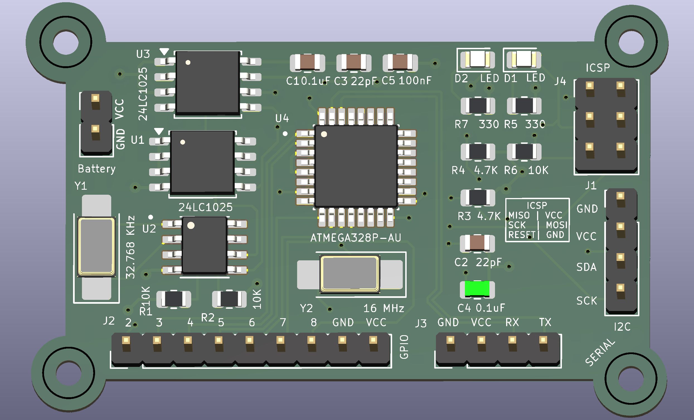
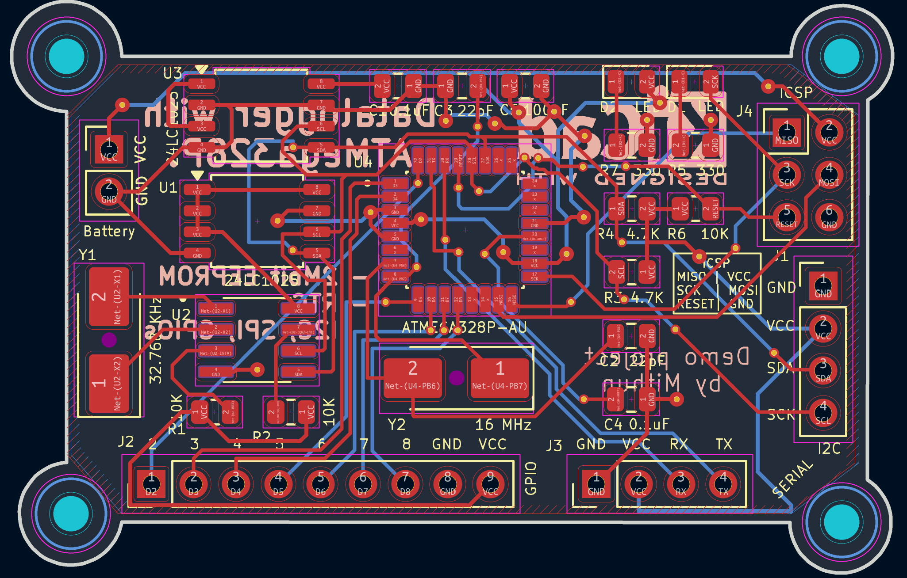
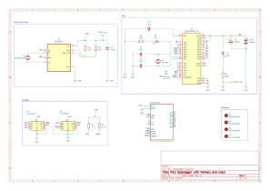

# MCU Datalogger (KiCad Project)

A custom MCU-based datalogger board designed in **KiCad 10.0**. This project was built as part of the **PCB Design with KiCad by Peter Dalmaris** course on Udemy to practice real-world schematic capture, PCB layout, and multi-layer board design.

The board reads sensor data and saves timestamped logs to external non-volatile memory using a Real-Time Clock (RTC).

---

## Screenshots & Renders

### 4-Layer Board

*Final 3D Render of 4-layer design with dedicated inner GND and Power planes.*

### 2-Layer vs. 4-Layer Evolution
I initially routed this board on 2 layers and later updated it to a 4-layer stackup to improve power distribution and signal integrity. Both versions are preserved in the Git history:

* **`main` / `4-layer` branch:** Final production layout using a 4-layer stackup (Top / GND Plane / VCC Plane / Bottom).
* **`2-layer` branch:** Original 2-layer prototype with routed power traces.

*2-Layer PCB Layout with Red Tracks as Front Copper and Blue Tracks as Back Copper.*

### Schematic

*Schematic of the MCU Datalogger in KiCad 10.0*
  
---

## Main Features & Components

* **Microcontroller:** Core MCU to manage sensors and memory logging.
* **Real-Time Clock (RTC):** Dedicated RTC chip with battery backup for accurate timestamping.
* **Non-Volatile Memory:** External memory chip to safely retain logs during power-down.
* **Power Net Class:** Custom net class rules applied to `/VCC` and `GND` traces for wider power routing and proper clearances.
* **4-Layer Stackup:** Continuous inner Ground plane (Layer 2) and Power plane (Layer 3) to keep power clean and noise low.

---

### Manufacturing & Design Trade-offs (PCBWay Quote Comparison)

I quoted both board designs on **pcbway.com** (52.83 mm × 34.31 mm standard options, 5 pcs) to evaluate cost versus performance:

* **2-Layer Board:** **~$5.00**
  * **Pros:** Extremely cheap to manufacture, fast prototyping turnaround, fine for simple low-speed routing, and quick manufacturing (~24 hours).
  * **Cons:** Harder to route clean power/GND return paths, higher potential for noise and EMI.
* **4-Layer Board:** **~$31.16**
  * **Pros:** Solid internal `GND` and `VCC` planes provide excellent signal integrity, low-noise power delivery, and easier trace routing.
  * **Cons:** Over 6x higher manufacturing cost, slightly longer production lead times (~4-5 days).

**Conclusion:** The 2-layer version is great for a budget prototype, but the 4-layer stackup is worth the extra cost for a production board to ensure stable MCU and memory operation.

---

## Acknowledgements & Course Credit

This project was built following the **PCB Design with KiCad by Peter Dalmaris** course on Udemy. 

**Key skills practiced:**
* Schematic capture and footprint assignment in KiCad 10.0.
* Routing 2-layer and 4-layer PCB stackups.
* Setting up custom Net Classes for power rails.
* Managing EDA files and PCB branch merges using Git and GitHub Desktop.

---

**Designed by Mithun**
